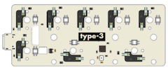
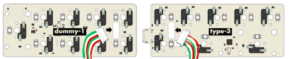
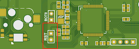

# kbdcraft-vial-qmk
My own custom firmwares for my [kbdcraft](https://kbdcraft.store) keyboard setups

I purchased keyboards and accessories from [kbdcraft](https://kbdcraft.store), but had some issues attempting to connect multiple of the same board —
particularly the [#18 Lilin](https://kbdcraft.store/blogs/news/lilin) and [#2 Lilith](https://kbdcraft.store/blogs/news/lilith).
This is because those particular boards use the same firmware, and thus are recognized by the OS as the same board. So I built my own custom firmwares
with differing product ids so that they may work together in harmony.

### Product ID Algorithm
Because the main point of contention here was the clashing product ids, I made my own little mnemonic / algorithm to make sure I avoided futute clashes:  
Product IDs are input as a 4-digit hexadecimal value
- First two digits represent the Angel number
- Last two digits represent the number of keys on the keyboard

For example, a standard #18 Lilin with included dummy board has 17 keys (as many as a regular numpad) so its product id becomes `0x1211`
(18 becomes `0x12` in hex, and 17 becomes `0x11`).  
Alternately, the original #2 Lilin board by itself has 64 keys, so that becomes `0x0240`.

## Included Firmwares
- `kbdcraft_lilin8_vial.uf2` (`0x1208`) — #18 Lilin (type-3) with no attachments  

- `kbdcraft_lilin17_vial.uf2` (`0x1211`) — #18 Lilin (type-3) attached to dummy module (dummy-1)  

## Flashing Instructions:
- Unplug the keyboard
- While holding the top right button of the keyobard (e.g. minus for Lilin, backspace for Lilith) plug the keyboard into the computer
- An external drive named "Addams0110" will appear on the computer, release the button
- Copy the firmware file (`.uf2`) to the external drive
- The external drive will disappear, the PCB will install the firmware, and the newly flashed keyboard will become connected to the computer

### Troubleshooting
If the external drive refuses to appear on the computer try the following:
- Attempt to locate the reset pins on the bottom of the PCB  

- While plugged into the computer, use some sort of conductive bridge (for example a pair of metal tweezers) to connect the two pins
- An external drive named "Addams0110" should appear on the computer, continue with the steps above

If the above still doesn't work, please seek support on the [KBDCrafter Discord server](https://discord.com/invite/UJhkTXfAKJ)

## Building from source:
- Clone the Vial repo from <https://github.com/vial-kb/vial-qmk>
- Install QMK, following the first three steps here: <https://docs.qmk.fm/newbs_getting_started>
- In the Vial repo, run `make git-submodule` to install the submodules correctly
- Copy the `keyboards` folder from this repo into the Vial repo
- Run `make <path>:vial` for the firmware you wish to make, where `<path>` is the subfolder of `keyboards/` you wish to build.
For example, to build the Lilin 17 firmware, run `make kbdcraft/lilin17:vial`
